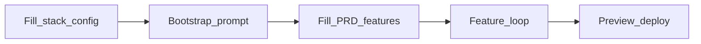

# Blueprint — Target template structure

```text
claude-mvp-template/          # (implement later; this folder is the summary only)
├── CLAUDE.md
├── AGENTS.md
├── stack.config.yaml         # ★ source of truth for toolchain/deps
├── stack.config.example.yaml
├── stack.config.schema.json
├── scripts/
│   ├── validate-stack-config.mjs
│   └── apply-stack-config.mjs
├── .cursor/rules/
│   ├── 00-immutable.mdc
│   ├── 05-stack-config.mdc
│   ├── 10-backend.mdc
│   ├── 20-frontend.mdc
│   └── 30-deploy-safety.mdc
├── .claude/skills/
│   ├── bootstrap/
│   ├── generate-feature/
│   ├── review-code/
│   └── deploy/
├── prompts/
│   ├── bootstrap-from-config.md
│   ├── generate-dto.md
│   ├── generate-service.md
│   ├── generate-controller.md
│   ├── generate-fe-page.md
│   ├── write-test.md
│   └── review-security.md
├── docs/
│   ├── _blank/
│   ├── _example-taskflow/
│   └── features/
├── apps/
│   ├── web/                  # Vite React ...
│   └── api/                  # NestJS Prisma Auth + 1 CRUD
├── packages/shared/
├── deploy/
│   ├── Dockerfile.api
│   ├── railway.toml
│   ├── vercel.json
│   ├── .github/workflows/
│   └── .env.example
└── tutorial/
    └── DAY0-4.md
```

## Day 0 flow



## Preset v1

Supported profile only: `nest-react-prisma`

- FE: React 18 + Vite + Tailwind + shadcn + TanStack Query + Zustand + RHF + Zod + Axios
- BE: NestJS + Prisma + PostgreSQL + JWT cookie + class-validator
- Deploy: Vercel + Railway + Docker
